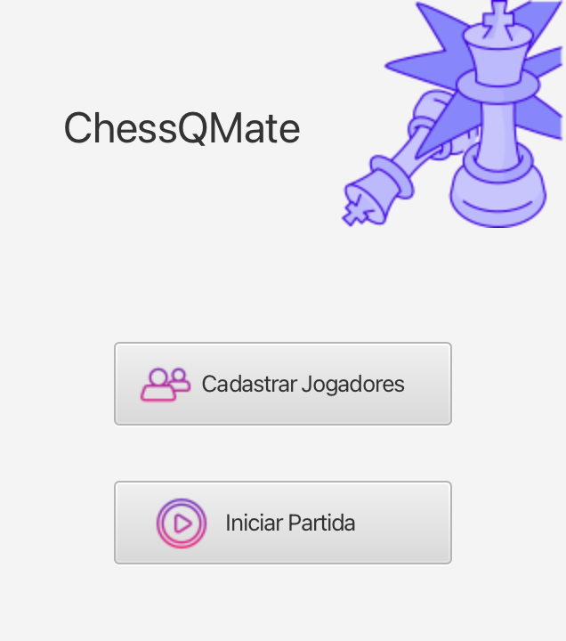
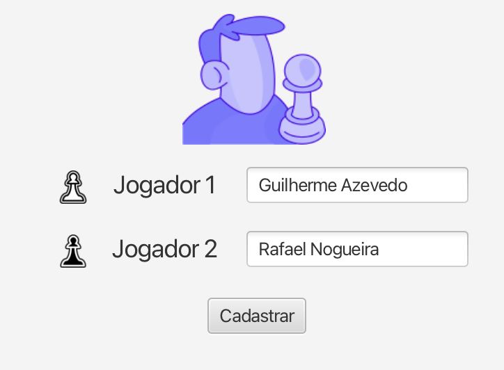
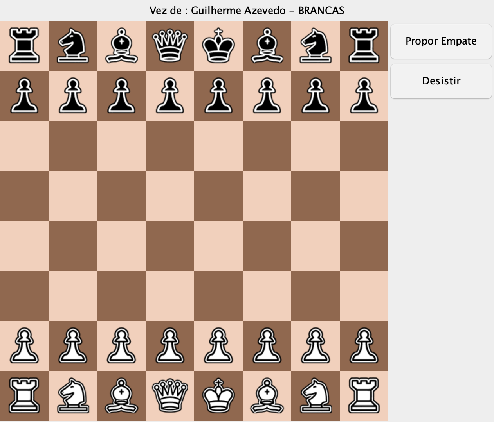
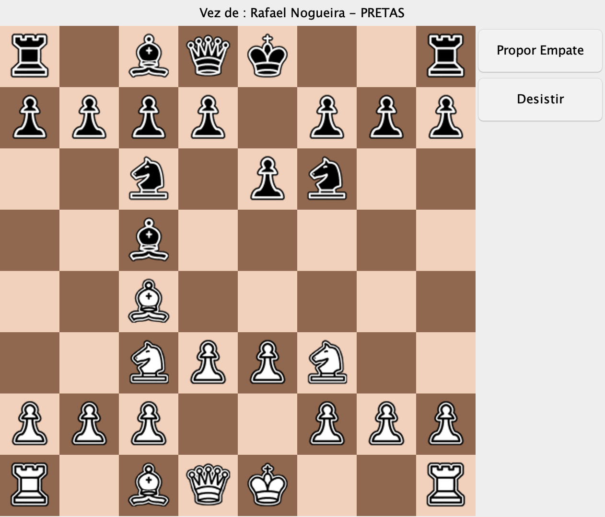

<h1 align="center">Jogo de Xadrez</h1>

<p align="center"><em>ChessQMate — um xadrez para dois jogadores em Java, com telas em JavaFX/FXML e tabuleiro desenhado em Swing.</em></p>

<p align="center">
  
  
  
  
  
</p>

<p align="center"><b>Português</b> · <a href="README.en.md">English</a></p>

---

## 📸 Preview

<p align="center">
  
</p>

<p align="center"><sub>Menu inicial: cadastro de jogadores e início da partida.</sub></p>

<p align="center">
  
</p>

<p align="center"><sub>Cadastro dos dois jogadores.</sub></p>

<p align="center">
  
</p>

<p align="center"><sub>Tabuleiro na posição inicial, com o indicador de vez e o painel lateral.</sub></p>

<p align="center">
  
</p>

<p align="center"><sub>Partida em andamento após alguns lances de desenvolvimento; a vez já passou para as peças pretas.</sub></p>

<p align="center">
  
</p>

<p align="center"><sub>Aviso exibido quando se tenta iniciar a partida sem os dois jogadores cadastrados.</sub></p>

---

## 📌 Contexto e Motivação

Este foi o **projeto final da disciplina de Paradigmas de Programação B**, cursada na PUC-Campinas no segundo semestre de 2021. A proposta era construir uma aplicação desktop completa em Java, exercitando na prática os conceitos de orientação a objetos vistos em aula: herança, classes abstratas, polimorfismo, encapsulamento e separação entre modelo e interface.

Escolhi o xadrez porque ele obriga a modelar um domínio de verdade. Cada tipo de peça se comporta de um jeito diferente, mas todas compartilham estado e responsabilidades comuns — exatamente o cenário em que uma hierarquia de classes com um método abstrato de validação faz sentido. Foi também meu primeiro contato sério com Java e com a construção de interfaces gráficas.

---

## 🧰 Stack de Tecnologias

| Tecnologia | Versão | Papel no projeto |
| --- | --- | --- |
| Java (JDK) | 17 na época; validado aqui com **Temurin 23.0.2** | Linguagem e runtime de toda a aplicação |
| JavaFX | 17.0.1 na época; validado aqui com **OpenJFX 21.0.5** | Telas de menu, cadastro e aviso, declaradas em FXML |
| FXML | — | Marcação declarativa das três telas, ligada aos controllers por `fx:controller` |
| Swing / AWT | Parte do JDK | Janela do tabuleiro: `JFrame`, `JPanel` com `GridLayout(8,8)` e `JLabel` para as peças |
| Visual Studio Code | — | IDE usada no desenvolvimento (`.vscode/launch.json` e `settings.json` versionados) |

O projeto usa **duas bibliotecas gráficas ao mesmo tempo**, e isso é intencional no código: as telas de fluxo (menu, cadastro, aviso) são JavaFX carregadas de arquivos `.fxml`, enquanto o tabuleiro é montado programaticamente em Swing, sem FXML. Não há Maven, Gradle nem dependências externas — a compilação é feita direto com `javac`.

---

## ⚙️ Configuração do Ambiente

Como o JavaFX deixou de ser distribuído junto com o JDK a partir do Java 11, é preciso baixá-lo à parte.

1. **JDK 17 ou superior.** A última validação deste README foi feita com o Temurin 23.0.2:

   ```bash
   java -version
   # openjdk version "23.0.2" 2025-01-21
   ```

2. **OpenJFX SDK.** Baixe o SDK do [gluonhq.com/products/javafx](https://gluonhq.com/products/javafx) para a sua plataforma, descompacte e aponte uma variável para a pasta:

   ```bash
   export JAVAFX_HOME=/caminho/para/javafx-sdk-21.0.5
   ```

Os módulos necessários são `javafx.controls` e `javafx.fxml`; os demais (`javafx.base`, `javafx.graphics`) vêm por dependência transitiva.

---

## ▶️ Executando o Projeto

Todos os comandos devem ser executados **a partir da raiz do repositório**. Isso não é detalhe: as imagens das peças e o ícone da janela são carregados por caminho relativo de sistema de arquivos (`src/images/...`), então o diretório de trabalho precisa ser a raiz do projeto ou as peças não aparecem no tabuleiro.

**1. Compilar**

```bash
javac -encoding UTF-8 -d bin \
  --module-path "$JAVAFX_HOME/lib" \
  --add-modules javafx.controls,javafx.fxml \
  $(find src -name '*.java')
```

**2. Copiar os recursos para o classpath**

Os arquivos `.fxml` são carregados pelo classloader e as imagens referenciadas dentro deles são resolvidas em relação ao próprio `.fxml`, então ambos precisam estar junto das classes compiladas:

```bash
cp -R src/fxmls src/images bin/
```

**3. Executar**

```bash
java -cp bin \
  --module-path "$JAVAFX_HOME/lib" \
  --add-modules javafx.controls,javafx.fxml \
  classes.Menu
```

Também é possível abrir o tabuleiro diretamente, sem passar pelo menu — útil durante o desenvolvimento, embora os nomes dos jogadores fiquem em branco:

```bash
java -cp bin \
  --module-path "$JAVAFX_HOME/lib" \
  --add-modules javafx.controls,javafx.fxml \
  classes.vision.JChess
```

E há ainda uma animação independente de sprites das peças, escrita como experimento em JavaFX e não integrada ao jogo:

```bash
java -cp bin \
  --module-path "$JAVAFX_HOME/lib" \
  --add-modules javafx.controls,javafx.fxml \
  classes.Animation
```

---

## 🎮 Como Jogar

O programa é iniciado em uma tela de **Menu**, que possui dois botões: um para o cadastro dos jogadores e outro para iniciar a partida.

1. **Cadastrar Jogadores** abre a tela de cadastro, com um campo para cada jogador. O botão *Cadastrar* grava os nomes e devolve o usuário ao menu.
2. **Iniciar Partida** só é permitido caso haja o cadastro de **ambos** os jogadores. Se algum dos nomes estiver vazio, o programa exibe a tela de aviso "Jogador(es) não cadastrado(s)!" e retorna ao menu.
3. Com os dois cadastrados, a **tela do tabuleiro** é aberta e nela encontram-se as peças de cada jogador. Para jogar basta **selecionar a peça** que deseja movimentar e então **clicar na posição para a qual deseja movê-la** — o jogo executará o lance caso ele seja possível. Clicar novamente na peça selecionada cancela a seleção.

O jogador 1 controla as brancas e começa a partida. O rótulo no topo da janela indica de quem é a vez, pelo nome cadastrado, e alterna a cada lance válido. O painel lateral traz os botões *Propor Empate* e *Desistir*.

---

## 🏛️ Modelo de Domínio

O código separa deliberadamente **regra de jogo** de **apresentação**, e essa separação está refletida nos pacotes.

```
classes.pieces   → o modelo: o que é uma peça e como ela se move
classes          → o estado da partida (Board) e o ponto de entrada JavaFX (Menu)
classes.vision   → a camada visual Swing do tabuleiro (prefixo J*)
controllers      → os controllers JavaFX das telas FXML
```

### Hierarquia de peças

`Piece` é uma **classe abstrata** que concentra tudo o que qualquer peça tem — cor (`ColorEnum.WHITE` / `BLACK`), linha, coluna, caminho da imagem, referência ao tabuleiro e os sinalizadores `captured`, `selected`, `possible` e `capturable`. Ela declara um único método abstrato:

```java
public abstract boolean checkMovement(int destinyLine, int destinyColumn);
```

```
                            Piece (abstract)
                                  │
      ┌──────────┬──────────┬─────┴─────┬──────────┬──────────┐
    Pawn       Rook       Knight      Bishop     Queen       King
```

Cada subclasse implementa `checkMovement` à sua maneira, e o `Board` chama sempre o método da superclasse — polimorfismo puro, sem `if` por tipo de peça. Essa é a espinha dorsal do exercício de orientação a objetos que a disciplina pedia.

### Camada de visão

A camada `vision` espelha o modelo em componentes Swing: `JChess` (`JFrame`) monta a janela, `JBoard` (`JPanel` com `GridLayout(8,8)`) desenha as 64 casas, `JSquare` (`JPanel`) representa uma casa e guarda sua linha/coluna, e `JPiece` (`JLabel`) carrega o ícone da peça. O tabuleiro é **desenhado em código**, não descrito em FXML.

O ciclo de interação é simples: `JBoard` escuta os cliques, traduz a casa clicada em coordenadas e chama `Board.performPlay(linha, coluna)`; o modelo decide se aquilo é uma seleção, um cancelamento ou um lance; em seguida `JBoard.drawBoard()` reconstrói a grade a partir do novo estado do modelo.

---

## 📁 Estrutura de Pastas

```
Xadrez/
├── src/                     todo o projeto em si, onde as alterações são feitas
│   ├── classes/             as classes do projeto
│   │   ├── Menu.java        Application JavaFX — ponto de entrada
│   │   ├── Board.java       estado da partida: matriz 8x8, seleção e turno
│   │   ├── Animation.java   animação de sprites em JavaFX (experimento à parte)
│   │   ├── pieces/          o modelo: Piece e suas seis subclasses + ColorEnum
│   │   └── vision/          camada visual Swing: JChess, JBoard, JSquare, JPiece
│   ├── controllers/         os controllers responsáveis pelas telas FXML
│   ├── fxmls/               todas as telas .FXML
│   └── images/              todas as imagens utilizadas durante o projeto
│       ├── pieces/whites/   peças brancas
│       ├── pieces/blacks/   peças pretas
│       ├── buttons/         ícones dos botões do menu
│       ├── animation/       quadros da animação
│       └── messages/        ícone da tela de aviso
├── bin/                     saída da compilação (cópia das classes e recursos)
├── docs/screenshots/        capturas de tela usadas neste README
└── .vscode/                 configurações de execução usadas no desenvolvimento
```

---

## 🚧 Estado do Projeto

Este projeto está na **release 0.6** por conta de ainda faltarem alguns pontos para atingir sua primeira versão 1.0. Para deixar claro o que o código realmente faz, segue o que está implementado e o que não está — tudo verificado diretamente no fonte.

**Funciona hoje**

- Fluxo completo de telas: menu, cadastro, validação do cadastro e abertura do tabuleiro.
- Tabuleiro de 64 casas montado com as 32 peças na posição inicial correta.
- Seleção e cancelamento de seleção de peça, com destaque de borda na casa selecionada.
- Alternância de turno entre brancas e pretas, com o nome do jogador da vez no topo da janela.
- Movimento com captura: ao mover para uma casa ocupada por peça adversária, a peça capturada é substituída no tabuleiro.
- Bloqueio de movimento sobre peça da mesma cor.

**Ainda não implementado**

- **Validação de movimento da maioria das peças.** Apenas `Pawn` e `Rook` têm regras próprias. `Knight`, `Bishop`, `Queen` e `King` implementam `checkMovement` retornando `true` incondicionalmente, ou seja, aceitam qualquer casa de destino.
- **Avanço duplo do peão.** O campo `firstMovement` existe em `Pawn` e é atualizado após o primeiro lance, mas `checkMovement` nunca o consulta: o peão anda somente uma casa.
- **Caminho livre para peças de longo alcance.** `Rook` verifica apenas se o destino está na mesma linha ou coluna; não há checagem de peças no meio do caminho, e o mesmo vale para bispo e dama.
- **Roque, en passant e promoção do peão** — nenhum dos três está no código.
- **Detecção de xeque, xeque-mate e empate.** Não existe verificação de rei em xeque nem condição de fim de partida; o jogo não termina sozinho.
- **Botões *Propor Empate* e *Desistir*.** Estão na interface e recebem `ActionListener`, mas o corpo dos listeners está vazio.
- **Destaque de casas possíveis e de peças capturáveis.** Os sinalizadores `possible` e `capturable` existem em `Piece` e o desenho das bordas verde e vermelha está escrito em `JSquare`, porém comentado.
- **Lista de peças capturadas.** As peças capturadas somem do tabuleiro sem serem registradas em nenhum lugar.

Há também resíduos de refatoração nos arquivos FXML: alguns `ImageView` apontam para uma pasta `imagens/` que foi renomeada para `images/` e não existe mais, duplicando os elementos que de fato carregam. Eles não quebram a execução — o JavaFX apenas não desenha a imagem ausente —, mas ficam como registro do estado em que o projeto foi entregue.

---

## 👥 Créditos

Desenvolvido por **Guilherme Gomes de Azevedo** — [@guiazevedo17](https://github.com/guiazevedo17).

Projeto final da disciplina de **Paradigmas de Programação B**, PUC-Campinas, segundo semestre de 2021.

### Considerações Finais

Apesar de, até a data de entrega em **07/12/2021**, o projeto não ter atingido sua versão final cumprindo todos os requisitos, o progresso do projeto em si e a evolução pessoal foram extremamente significativos: adquiri uma enorme quantidade de conhecimento e, junto com ela, uma vontade maior de buscar novos meios de solucionar os desafios que nos são propostos.

Gostaria de agradecer à **Pontifícia Universidade Católica de Campinas** e aos professores **Leandro Alonso Xastre** e **Daniele Cristina Uchoa Maia Rodrigues**, que ministraram a disciplina durante o segundo semestre de 2021 e nos possibilitaram essa experiência de primeiro contato com a linguagem Java e seus conceitos de programação orientada a objetos.

---

## ⚖️ Direitos

Projeto acadêmico, desenvolvido com finalidade educacional e mantido aqui como registro de aprendizado. O código pode ser consultado e reaproveitado livremente para fins de estudo. Os ícones e sprites em `src/images/` foram reunidos durante o desenvolvimento do trabalho e pertencem aos seus respectivos autores.
